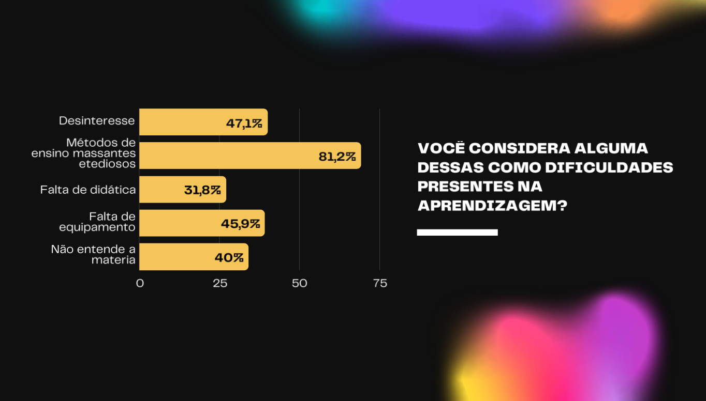
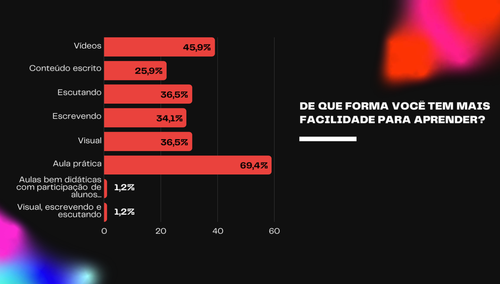
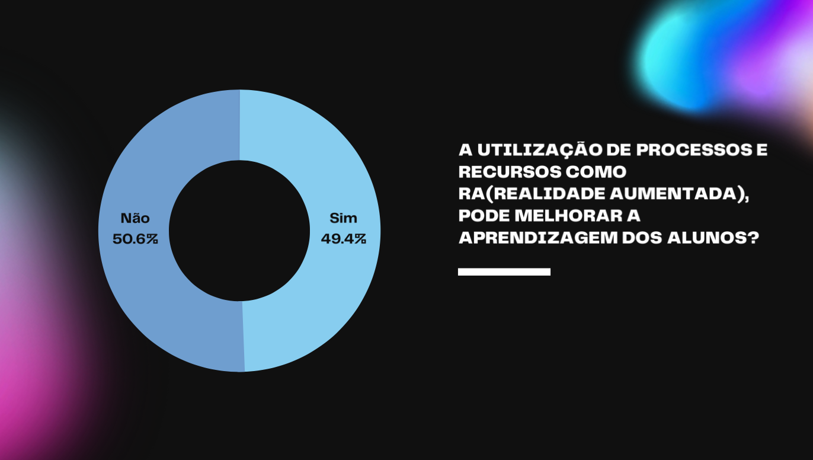
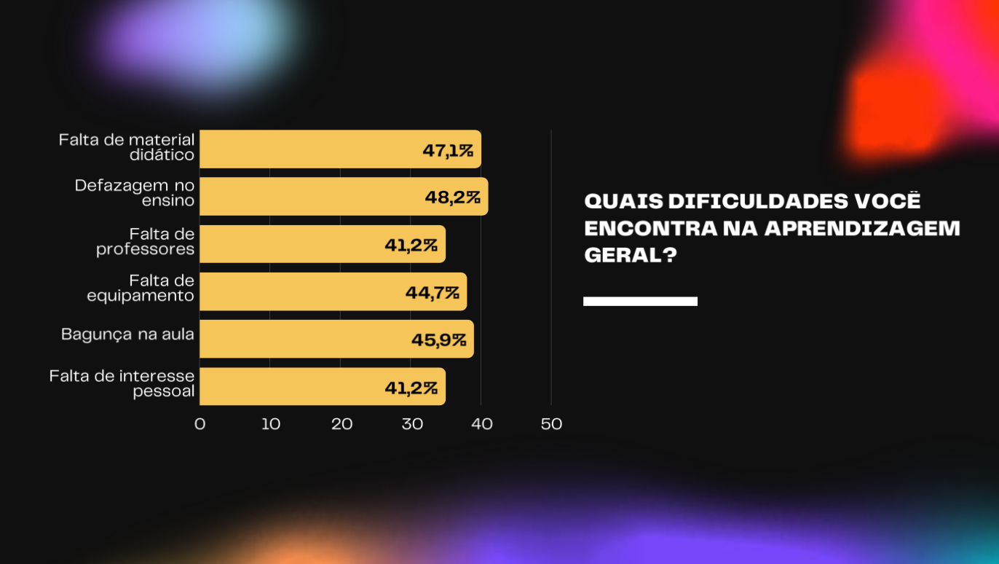
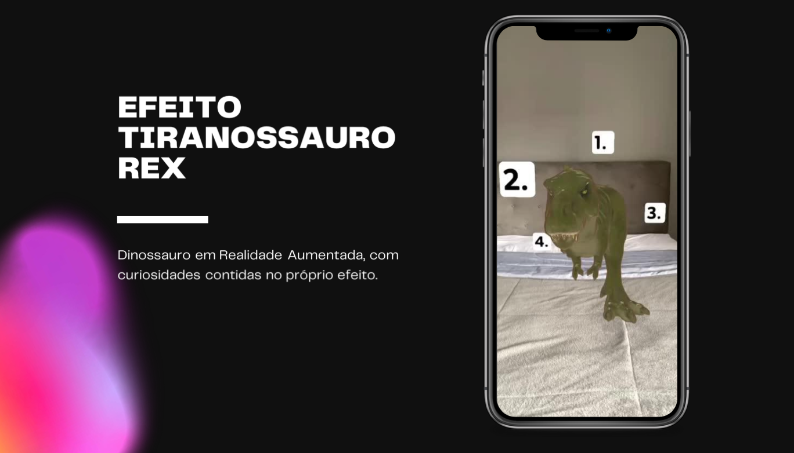
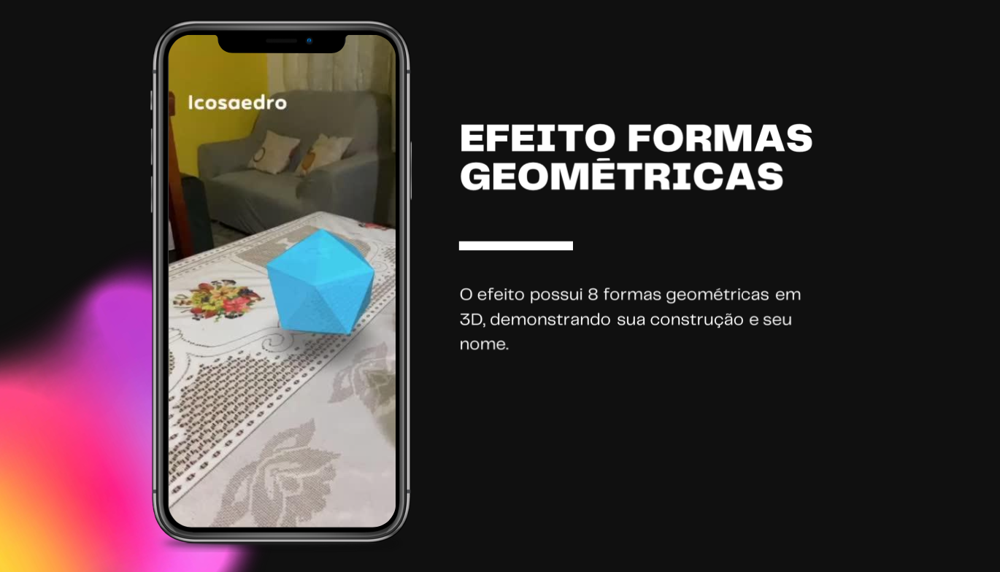

---
[Apresentação](./doc/apresentacao.pdf) • [Projeto Acadêmico](./doc/projeto.pdf)

# Introdução
Em face do cenário atual, é perceptível a importância da realidade virtual e aumentada para uma imersão em determinada situação ou assunto. Em âmbito escolar onde se tem um ambiente mais reduzido é de extrema importância fazermos uso dessas ferramentas para um maior aproveitamento do estudante.

# Objetivos
1. Trazer para as escolas de Perus tecnologia para auxiliar no ensino;
2. Analisar as Necessidades das materiais em relação;
3. Aplicabilidade de tecnologia no despertar do interesse dos alunos;
4. Desenvolver um aplicativo com RA, para catalogar os filtros para as escolas de Perus;
5. Aplicar o teste do aplicativo em escolas Piloto;
6. Analisar os resultados.

# Metodologia
Esse trabalho tem o objetivo exploratório pois nosso site buscará percorrer o uso da Realidade aumentada para qualificar, diversificar e potencializar o ensino nos âmbitos escolares das escolas periféricas, de modo que produza um melhor ensino e de forma interessante.

# Pesquisa e Resultados

1. Você considera alguma dessas como uma dificuldades presentes na aprendizagem?

2. De que forma você tem mais facilidade para aprender?

3. A utilização de processos e recursos como RA (Realidade Aumentada), pode melhorar a aprendizagem dos alunos?

4. Quais dificuldades você encontra na aprendizagem?

# Site de catálogo
O site busca catalogar todos os efeitos de Realidade Aumentada voltados para o estudo, facilitando o acesso ao público.

# Exemplos
Exemplos de Efeitos de Realidade Aumentada no contexto de aprendizagem

## Tiranossauro Rex

## Formas Geométricas 3D

# Viabilidade e Custos

|PRODUTO|COMPRA|VENDA|
|-|-|-|
TEMPLATE|R$ 240,00|R$ 0,00
PLUGIN|R$ 120,00|R$ 0,00
CUSTO DE MANUTENÇÃO|R$ 30,00/mês|R$ 20,00/mês
BACKUPS DIÁRIOS|R$ 30,00/mês|R$ 20,00/mês
SEGURANÇA DO SITE|R$ 500,00/anual|R$ 150,00/anual
ATUALIZAÇÃO SEMANAL| R$1 50,00| R$ 50,00
CARGA HORÂRIA|R$100,00|R$ 100,00
MÃO DE OBRA TÉCNICA|R$ 1.400,00|R$ 820,00
**TOTAL:**|**R$ 3.130,00**|**R$ 1.500,00**

# Considerações finais
Ao finalizar as pesquisas em relação a aplicabilidade do site, foi obtido que é de grande
interesse e que seria útil para despertar interesse nos alunos ferramentas que envolvessem a
ferramenta em questão, em âmbito escolar.
Através do desenvolvimento do aplicativo, o uso do site que pode ser feito através do
computador e Smartphone, se torna fácil e acessível tanto para alunos quanto para educadores.
Com os resultados em questão, de forma majoritária foi dito que vídeos e aulas práticas
facilitariam no processo do estudo. Neste caso, o site desenvolvido relaciona as duas áreas
através da realidade aumentada.
Com isso, conclui-se que a ferramenta é interessante para professores e alunos da comunidade
de Perus, contribuindo de diversas formas para o aprendizado geral. Levando em consideração
que o mesmo, envolve mais de um modo de aprendizagem, como: O visual, o teórico e o
cinestésico (que envolve as simulações).
Diante disso pode-se concluir que o trabalho cumpriu com objetivo, e além disso, ressaltou que
sim, a educação tem deficiências, e novos modos de ensino aplicado de maneira didática podem
ter um efeito melhor para a educação, sendo de grande auxílio para os professores de escolas
que sofrem por falta de recursos.
Como sugestão para trabalhos que sucederam este e como forma de agregar ainda mais ao
projeto, indica-se aplicar ao trabalho realizado abrangente ao site e aos filtros, adicionando
mais funções por meio de evoluir e desmembrar o projeto do modo usado para o trabalho inicial
(filtros usados pelo Instagram), podendo levar o projeto ao ponto de ter um aplicativo próprio
disponível para escolas e a todos que tenham interesse, curando a dependência da rede social
para a utilização do mesmo.
